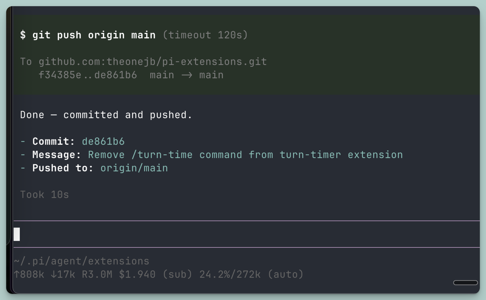

# pi-extensions

Source repo: https://github.com/theonejb/pi-extensions

A collection of custom [pi](https://github.com/badlogic/pi-mono) extensions.

As more extensions are added, this repo will hold them in one place.

## Install extensions

### Option 1: Global install (recommended)

Installs extensions for all projects.

```bash
git clone https://github.com/theonejb/pi-extensions.git
cd pi-extensions
mkdir -p ~/.pi/agent/extensions

# Copy one extension
cp turn-timer.ts ~/.pi/agent/extensions/turn-timer.ts

# (Optional) Copy all top-level .ts extensions
# cp ./*.ts ~/.pi/agent/extensions/
```

Then in pi:

```text
/reload
```

### Option 2: Project-local install

Installs extensions only for the current project.

```bash
mkdir -p .pi/extensions
cp /path/to/pi-extensions/turn-timer.ts .pi/extensions/turn-timer.ts
```

Then run `/reload` in pi.

## Extensions

### `turn-timer.ts`

Measures turn duration from:

- **Start:** timestamp of the last user message
- **End:** `agent_end`

Behavior:

- Shows notification when a turn completes, e.g. `Took 1.2s`

#### Screenshot



#### Quick test

1. Run `/reload`
2. Send any prompt
3. Confirm you see a notification like `Took 842ms`

### `review-for-agent.ts`

Auto-starts [`review-for-agent`](https://github.com/Waraq-Labs/review-for-agent) when pi starts **inside a git repo**.

Behavior:

- No-op if cwd is not a git repo
- No-op if `review-for-agent` is not installed on `PATH`
- No-op if lockfile already exists in the repo root (`.review-for-agent.pi.lock`)
- Best effort: adds `.review-for-agent.pi.lock` and `rfa/` to `.git/info/exclude` to avoid accidental commits
- Starts `review-for-agent --no-open` in the repo root
- Shows footer status while running (`rfa open`, with terminal hyperlink support; some terminals need a modifier key to follow links, e.g. Ghostty on macOS uses Cmd+click)
- Adds `/rfa-open` command to open the review URL from the repo lockfile in a browser (works even from a second pi session)
- On pi shutdown, kills the child process and removes the lockfile if owned by this session

## Uninstall

Remove the extension file and reload:

```bash
rm ~/.pi/agent/extensions/turn-timer.ts
# or: rm .pi/extensions/turn-timer.ts
```

Then run `/reload`.
